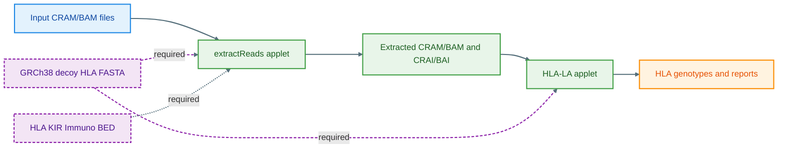

# HLA-LA on DNAnexus 

This hands-on guide walks participants through extracting HLA reads from CRAMs on **DNAnexus** and then typing HLA alleles with **HLA-LA**. 

> **Audience:** Mexican researchers.
>
> **You will:**
> (1) compile two WDLs to DNAnexus applets
> (2) run read extraction
> (3) run HLA-LA on the extracted reads.

---

###  HLA (Human Leukocyte Antigen)

The **HLA system** is a group of immune genes on chromosome 6 that help the body recognize “self” vs. “non-self.”

* **Class I (A, B, C):** Help with antigen presentation to CD8 T cells.
* **Class II (DR, DQ, DP):** Help with antigen presentation to CD4 T cells.
* Highly variable — key for **transplant matching**, **disease association**, and **drug response** studies.
  In this workflow, we use **HLA-LA** to identify each sample’s HLA alleles from sequencing data.

---

###  DNAnexus

**DNAnexus** is a secure, cloud platform for large-scale genomics.
It lets you:

* Store and organize data in *projects*
* Run reproducible workflows (e.g. WDLs) as *applets*
* Scale analyses across samples easily
  We’ll use it here to run **extractReads** and **HLA-LA** in the cloud.

---

## Workflow at a Glance



---

## Prerequisites

* DNAnexus project (example: `Genetics-Workshop-Mexico-2025`)
* DNAnexus **dx-toolkit** installed and logged in (`dx login`)
* Java 8+ for `dxCompiler`
* Reference FASTA: `GRCh38_full_analysis_set_plus_decoy_hla.fa` in your project
* Basic shell familiarity

> **Tip:** Keep your DNAnexus web project open to monitor jobs.

---

## Quick Start 

```bash
# (1) Set your project and paths
export PROJECT="Genetics-Workshop-Mexico-2025"

# (2) Create output folder
dx mkdir -p "Outputs"

# (3) Download dxCompiler (v2.14.0)
wget -q \
  https://github.com/dnanexus/dxCompiler/releases/download/2.14.0/dxCompiler-2.14.0.jar \
  -O dxCompiler-2.14.0.jar

# (4) Download refererence
GRCh38_full_analysis_set_plus_decoy_hla.fa

# (5) Download test data
wget http://ftp.1000genomes.ebi.ac.uk/vol1/ftp/data_collections/1000_genomes_project/data/MXL/NA19648/alignment/NA19648.alt_bwamem_GRCh38DH.20150718.MXL.low_coverage.cram

wget http://ftp.1000genomes.ebi.ac.uk/vol1/ftp/data_collections/1000_genomes_project/data/MXL/NA19648/alignment/NA19648.alt_bwamem_GRCh38DH.20150718.MXL.low_coverage.cram.crai

# (6) Download wdl file
Download `extractReads.wdl`and `hla-la.wdl` files from the workshop DNA Nexus page
```
---

## Part 1 — Extract HLA Reads

### 1. Upload the Samtools container

```bash
wget -O docker-samtools-1.3.tar.gz \
  'https://www.dropbox.com/scl/fi/2p10uuv5ovyz5ku5k72h0/docker-samtools-1.3.tar.gz?rlkey=q4qul96p8t8bq5i72e4lc6v9s&dl=1'

dx upload docker-samtools-1.3.tar.gz
```

### 2. Download and edit `extractReads.wdl`

```bash
#Repository is private but this is the source
Download `extractReads.wdl` file to your computer & upload to JupyterLab 

# Edit the WDL line with full path to the samtools:
docker: "dx://Genetics-Workshop-Mexico-2025:/7_HLA_analysis_on_DNA_Nexus/docker-samtools-1.3.tar.gz"
```

### 3. Compile to DNAnexus applet
#### Install java

```bash
conda install -y -c conda-forge openjdk=11
```

```bash
java -jar dxCompiler-2.14.0.jar compile extractReads.wdl -f
```

### 4. Upload BED and create folder

```bash
wget -q \
  https://raw.githubusercontent.com/DiltheyLab/MarieAlexKIR/main/HLA_and_KIR_and_Immuno.bed \
  -O HLA_and_KIR_and_Immuno.bed

dx upload HLA_and_KIR_and_Immuno.bed
```

### 5. Run `extractReads`

**Single sample example:**

```bash
dx run /extractReads -ireference="Genetics-Workshop-Mexico-2025:/GRCh38_full_analysis_set_plus_decoy_hla.fa" -itargetRegions="Genetics-Workshop-Mexico-2025:/HLA_and_KIR_and_Immuno.bed" -imapped_read="Genetics-Workshop-Mexico-2025:/Data/NA19648.alt_bwamem_GRCh38DH.20150718.MXL.low_coverage.cram" --folder="Genetics-Workshop-Mexico-2025:/Outputs"
```

**Multiple samples (loop):**

```bash
#Full command for multiple samples
dx run \
--priority low /extractReads \
-ireference="Genetics-Workshop-Mexico-2025:/GRCh38_full_analysis_set_plus_decoy_hla.fa" \
-itargetRegions="Genetics-Workshop-Mexico-2025:/HLA_and_KIR_and_Immuno.bed" \ # downloaded from Alex Github page
-imapped_read="Genetics-Workshop-Mexico-2025:/Data/NA19648.alt_bwamem_GRCh38DH.20150718.MXL.low_coverage.cram" \
#-imapped_read="/Bulk/Whole genome sequences/Whole genome CRAM files/10/1033931_23193_0_0.cram" \
#-imapped_read="/Bulk/Whole genome sequences/Whole genome CRAM files/10/1073611_23193_0_0.cram" \
--folder="Genetics-Workshop-Mexico-2025:/Outputs"
```
---

## Part 2 — Run HLA-LA

### 1. Upload HLA-LA container

```bash
wget -O docker-hla-la-1.0.8-fast-cram.tar.gz \
  'https://www.dropbox.com/scl/fi/yeisml3kez9y13wj6agn1/docker-hla-la-1.0.8-fast-cram.tar.gz?rlkey=lk97bvzoghnuqsavf8vh6ncg4&dl=1'

dx upload docker-hla-la-1.0.8-fast-cram.tar.gz
```

### 2. Download and edit `hla-la.wdl`

```bash
Download `hla-la.wdl` file to your computer & upload to JupyterLab
```

For the test data, skip and move to compiling.
For your own data, do the following:
```
# Edit docker line with full path:
docker: "dx://Genetics-Workshop-Mexico-2025:/7_HLA_analysis_on_DNA_Nexus/docker-hla-la-1.0.8-fast-cram.tar.gz"

#modify line to only remain with base name for your sample ID:
sampleIDs=$(echo $samplePaths | perl -MFile::Basename -ne '@p = split(/,/, $_); print join(",", map {my $f = (fileparse($_, ".cram"))[0]; $f =~ s/.dragen_extracted//; $f =~ s/.alt_bwamem_GRCh38DH.20150718.MXL.low_coverage_extracted//; $f} @p);')

#add the base name based on your data
file_prefix="${file_prefix%.alt_bwamem_GRCh38DH.20150718.MXL.low_coverage_extracted}"
```                

### 3. Compile to applet

```bash
java -jar dxCompiler-2.14.0.jar compile hla-la.wdl -f
```

### 4. Run HLA-LA (single sample)

```bash
dx run --priority high   --cost-limit 3 /hla_la   -ireference="Genetics-Workshop-Mexico-2025:/GRCh38_full_analysis_set_plus_decoy_hla.fa"   -iapplyT1K="false"   -iapplyPING="false"   -imapped_read="Genetics-Workshop-Mexico-2025:/Outputs/NA19648.alt_bwamem_GRCh38DH.20150718.MXL.low_coverage_extracted.cram"   -imapped_read_index="Genetics-Workshop-Mexico-2025:/Outputs/NA19648.alt_bwamem_GRCh38DH.20150718.MXL.low_coverage_extracted.cram.crai"   --folder="Genetics-Workshop-Mexico-2025:/Outputs"
```

---

## Outputs

* Extracted CRAMs and CRAIs
* HLA typing results from HLA-LA per sample

---

## Useful Commands
```bash
# List project contents
dx ls "$PROJECT:/$OUTFOLDER"

# Monitor jobs
dx watch job-XXXX

# Describe a job
dx describe job-XXXX --verbose
```

---

## Troubleshooting

* **File not found:** check full DNAnexus path.
* **Applet name mismatch:** run `dx ls` and adjust names.
* **dxCompiler memory issues:** increase heap (`JAVA_TOOL_OPTIONS=-Xmx4g`).
* **Missing index:** ensure `.crai` is uploaded.
* **Odd sample IDs:** adjust filename trimming in the WDL.
* **A linked object
  to be cloned is not in the closed state:** delete & redownload the hla-la docker container

---

## Reproducibility

* Save all your commands to a script.
* Record job metadata: `dx describe -j job-XXXX > record.json`.
* Keep container names and compiler versions pinned.

---

## 📚 References

* [DiltheyLab/MarieAlexKIR GitHub](https://github.com/DiltheyLab/MarieAlexKIR)
* [HLA-LA (Nature Communications, 2019)](https://www.nature.com/articles/s41467-019-11167-x)
* [DNAnexus Documentation](https://documentation.dnanexus.com)

---
