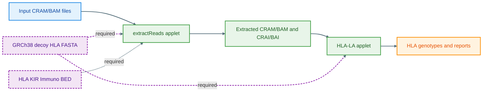

# HLA-LA on DNAnexus

This hands-on guide walks participants through extracting HLA reads from CRAMs or BAMs (output from mapping) on **DNAnexus** and then typing HLA alleles with **HLA-LA** tool.

> **Audience:** Mexican researchers  
> **You will:**  
> (1) compile two WDLs to DNAnexus applets  
> (2) run read extraction  
> (3) run HLA-LA on the extracted reads  

---

## Table of Contents

<details open>
<summary>Click to expand/collapse</summary>

- [Part A — Pre-Workshop Setup (on JupyterLab)](#-part-a--pre-workshop-setup-on-jupyterlab)
  - [1. Requirements](#1-requirements)
  - [2. Set Up Environment](#2-set-up-environment)
  - [3. Install Dependencies](#3-install-dependencies)
  - [4. Verify Required Files in DNAnexus](#4-verify-required-files-in-dnanexus)
  - [5. Download dxCompiler](#5-download-dxcompiler)
  - [✅ Pre-Workshop Checklist](#-pre-workshop-checklist)
- [Background Information](#-background-information)
  - [HLA (Human Leukocyte Antigen)](#hla-human-leukocyte-antigen)
  - [DNAnexus Overview](#dnanexus-overview)
  - [Workflow at a Glance](#workflow-at-a-glance)
- [Part B — Workshop: Running HLA-LA on DNAnexus](#-part-b--workshop-running-hla-la-on-dnanexus)
  - [Workflow Overview](#workflow-overview)
  - [Part 1 — Extract HLA Reads](#part-1--extract-hla-reads)
  - [Part 2 — Run HLA-LA](#part-2--run-hla-la)
  - [Outputs](#outputs)
  - [Next Steps](#next-steps)
  - [Useful Commands](#useful-commands)
  - [Troubleshooting](#troubleshooting)
  - [Reproducibility](#reproducibility)
  - [📚 References](#-references)

</details>

---

## Part A — Pre-Workshop Setup (on JupyterLab)

All setup and verification can be done directly in **JupyterLab** before the session.  
By the end of this section, your DNAnexus environment will be ready for the hands-on steps.

---

### 1. Requirements

* DNAnexus account and project (example: `Genetics-Workshop-Mexico-2025`)
* DNAnexus **dx-toolkit** installed and logged in (`dx login`)
* Java 8+ for `dxCompiler`
* Basic shell familiarity

> **Tip:** Keep your DNAnexus web project open to monitor jobs.

---

### 2. Set Up Environment

```bash
# Set your DNAnexus project
export PROJECT="Genetics-Workshop-Mexico-2025"

# Create output folder in project
dx mkdir -p "Outputs"
```

---

### 3. Install tools & Dependencies
Install OpenJDK (Java 11) for dxCompiler
```
conda install -y -c conda-forge openjdk=11

```

Download dxCompiler
```
wget -q \
  https://github.com/dnanexus/dxCompiler/releases/download/2.14.0/dxCompiler-2.14.0.jar \
  -O dxCompiler-2.14.0.jar

```
---

### 4. Verify Required Files in DNAnexus

All necessary data, workflows, and containers have already been placed in the DNAnexus project.

Please ensure you can see the following in your project:

Data folder
- Data/NA19648.alt_bwamem_GRCh38DH.20150718.MXL.low_coverage.cram
- Data/NA19648.alt_bwamem_GRCh38DH.20150718.MXL.low_coverage.cram.crai

Main folder
- docker-samtools-1.3.tar.gz
- docker-hla-la-1.0.8-fast-cram.tar.gz
- extractReads.wdl
- hla-la.wdl

Reference files
- GRCh38_full_analysis_set_plus_decoy_hla.fa
- HLA_and_KIR_and_Immuno.bed

If any file is missing, notify the workshop facilitator before proceeding.

---
### ✅ Pre-Workshop Checklist

Before the workshop, confirm you have:

- [x] Access to DNAnexus and logged in with `dx login`  
- [x] Java installed and `dxCompiler` downloaded  
- [x] Data files visible in `/Data`  
- [x] WDLs visible in `7_HLA_analysis_on_DNA_Nexus`  
- [x] Docker containers and reference files present in project

---

## Background Information

###  HLA (Human Leukocyte Antigen)

The **HLA system** is a group of immune genes on chromosome 6 that help the body recognize “self” vs. “non-self.”

* **Class I (A, B, C):** Help with antigen presentation to CD8 T cells.
* **Class II (DR, DQ, DP):** Help with antigen presentation to CD4 T cells.
* Highly variable — key for **transplant matching**, **disease association**, and **drug response** studies.
  In this workflow, we use **HLA-LA** to identify each sample’s HLA alleles from sequencing data.

---

###  DNAnexus

**DNAnexus** is a secure, cloud platform for large-scale genomics.
It lets you:

* Store and organize data in *projects*
* Run reproducible workflows (e.g. WDLs) as *applets*
* Scale analyses across samples easily
  We’ll use it here to run **extractReads** and **HLA-LA** in the cloud.

---

### Workflow at a Glance



---

## 🧪 Part B — Workshop: Running HLA-LA on DNAnexus

In this section, you’ll compile the WDLs into DNAnexus applets and run the two main steps:  
**(1) extract HLA reads** and **(2) perform HLA typing.**

---

### Part 1 — Extract HLA Reads

#### 1. Compile `extractReads.wdl`

```bash
# Confirm docker line in WDL points to:
docker: "dx://Genetics-Workshop-Mexico-2025:/docker-samtools-1.3.tar.gz"

# Compile to DNAnexus applet
java -jar dxCompiler-2.14.0.jar compile extractReads.wdl -f
```

#### 2. Run `extractReads`

**Single sample example:**

```bash
dx run /extractReads -ireference="Genetics-Workshop-Mexico-2025:/GRCh38_full_analysis_set_plus_decoy_hla.fa" -itargetRegions="Genetics-Workshop-Mexico-2025:/HLA_and_KIR_and_Immuno.bed" -imapped_read="Genetics-Workshop-Mexico-2025:/Data/NA19648.alt_bwamem_GRCh38DH.20150718.MXL.low_coverage.cram" --folder="Genetics-Workshop-Mexico-2025:/Outputs"
```

**Multiple samples (loop):**

```bash
#Full command for multiple samples
dx run \
--priority low /extractReads \
-ireference="Genetics-Workshop-Mexico-2025:/GRCh38_full_analysis_set_plus_decoy_hla.fa" \
-itargetRegions="Genetics-Workshop-Mexico-2025:/HLA_and_KIR_and_Immuno.bed" \ # downloaded from Alex Github page
-imapped_read="Genetics-Workshop-Mexico-2025:/Data/NA19648.alt_bwamem_GRCh38DH.20150718.MXL.low_coverage.cram" \
#-imapped_read="/Bulk/Whole genome sequences/Whole genome CRAM files/10/1033931_23193_0_0.cram" \
#-imapped_read="/Bulk/Whole genome sequences/Whole genome CRAM files/10/1073611_23193_0_0.cram" \
--folder="Genetics-Workshop-Mexico-2025:/Outputs"
```
---

### Part 2 — Run HLA-LA

#### 1. Compile hla-la.wdl

```bash
# Confirm docker line in WDL points to:
docker: "dx://Genetics-Workshop-Mexico-2025:/docker-hla-la-1.0.8-fast-cram.tar.gz"

# Compile to DNAnexus applet
java -jar dxCompiler-2.14.0.jar compile hla-la.wdl -f
```

##### NOTE:
For your own data, do the following:
```
# Edit docker line with full path:
docker: "dx://Genetics-Workshop-Mexico-2025:/7_HLA_analysis_on_DNA_Nexus/docker-hla-la-1.0.8-fast-cram.tar.gz"

#modify line to only remain with base name for your sample ID:
sampleIDs=$(echo $samplePaths | perl -MFile::Basename -ne '@p = split(/,/, $_); print join(",", map {my $f = (fileparse($_, ".cram"))[0]; $f =~ s/.dragen_extracted//; $f =~ s/.alt_bwamem_GRCh38DH.20150718.MXL.low_coverage_extracted//; $f} @p);')

#add the base name based on your data
file_prefix="${file_prefix%.alt_bwamem_GRCh38DH.20150718.MXL.low_coverage_extracted}"

#then compile
```                

#### 2. Run HLA-LA (Single Sample Example)

```bash
dx run --priority high   --cost-limit 3 /hla_la   -ireference="Genetics-Workshop-Mexico-2025:/GRCh38_full_analysis_set_plus_decoy_hla.fa"   -iapplyT1K="false"   -iapplyPING="false"   -imapped_read="Genetics-Workshop-Mexico-2025:/Outputs/NA19648.alt_bwamem_GRCh38DH.20150718.MXL.low_coverage_extracted.cram"   -imapped_read_index="Genetics-Workshop-Mexico-2025:/Outputs/NA19648.alt_bwamem_GRCh38DH.20150718.MXL.low_coverage_extracted.cram.crai"   --folder="Genetics-Workshop-Mexico-2025:/Outputs"
```

---

## Outputs

* Extracted CRAMs and CRAIs
* HLA typing results from HLA-LA per sample
`example output on the DNA Nexus workshop page`

---
## Next steps
Convert in to a HLA PED file using the script `combineHLA_LA.sh` on the home page.

## Useful Commands
```bash
# List project contents
dx ls "$PROJECT:/$OUTFOLDER"

# Monitor jobs
dx watch job-XXXX

# Describe a job
dx describe job-XXXX --verbose
```

---

## Troubleshooting

* **File not found:** check full DNAnexus path.
* **Applet name mismatch:** run `dx ls` and adjust names.
* **dxCompiler memory issues:** increase heap (`JAVA_TOOL_OPTIONS=-Xmx4g`).
* **Missing index:** ensure `.crai` is uploaded.
* **Odd sample IDs:** adjust filename trimming in the WDL.
* **A linked object
  to be cloned is not in the closed state:** delete & redownload the hla-la docker container

---

## Reproducibility

* Save all your commands to a script.
* Record job metadata: `dx describe -j job-XXXX > record.json`.
* Keep container names and compiler versions pinned.

---

## 📚 References

* [DiltheyLab/MarieAlexKIR GitHub](https://github.com/DiltheyLab/MarieAlexKIR)
* [HLA-LA (Nature Communications, 2019)](https://www.nature.com/articles/s41467-019-11167-x)
* [DNAnexus Documentation](https://documentation.dnanexus.com)

---
