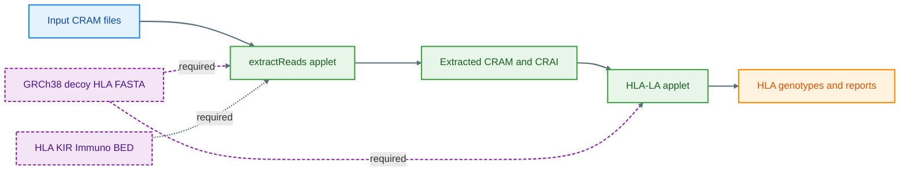

# Running HLA-LA on DNAnexus 

This hands-on guide walks participants through extracting HLA/KIR-region reads from CRAMs on **DNAnexus** and then typing HLA alleles with **HLA-LA**. It’s designed for a workshop setting: copy-paste friendly, with clear checkpoints and troubleshooting.

> **Audience:** Researchers with basic command-line skills and access to a DNAnexus project.
>
> **You’ll do:** (1) compile two WDLs to DNAnexus applets, (2) run read extraction, (3) run HLA-LA on the extracted reads.

---

### 🧬 HLA (Human Leukocyte Antigen)

The **HLA system** is a group of immune genes on chromosome 6 that help the body recognize “self” vs. “non-self.”

* **Class I (A, B, C):** show peptides from inside cells to CD8 T cells.
* **Class II (DR, DQ, DP):** show external peptides to CD4 T cells.
* Highly variable — key for **transplant matching**, **disease association**, and **drug response** studies.
  In this workflow, we use **HLA-LA** to identify each sample’s HLA alleles from sequencing data.

---

### ☁️ DNAnexus

**DNAnexus** is a secure, cloud platform for large-scale genomics.
It lets you:

* Store and organize data in *projects*
* Run reproducible workflows (e.g. WDLs) as *applets*
* Scale analyses across samples easily
  We’ll use it here to run **extractReads** and **HLA-LA** in the cloud.

---

## 🖼️ Workflow at a Glance (Intro Visual)



---

## 🧩 Prerequisites

* DNAnexus project (example used throughout: `2023_012_Yang_Luo`)
* DNAnexus **dx-toolkit** installed and logged in (`dx login`)
* Java 8+ for `dxCompiler`
* Reference FASTA available in the project: `GRCh38_full_analysis_set_plus_decoy_hla.fa`
* Basic shell familiarity

> **Tip:** Keep the browser open to monitor jobs while you run commands locally.

---

## Quick Start 

```bash
# (1) Set your project/paths once, then copy-paste commands below as-is
export PROJECT="2023_012_Yang_Luo"
export OUTFOLDER="Outputs-trial"
export REF="$PROJECT:/GRCh38_full_analysis_set_plus_decoy_hla.fa"

# (2) Create an outputs folder (safe if already exists)
dx mkdir -p "$OUTFOLDER"

# (3) Fetch dxCompiler (v2.14.0) and place in working dir
wget -q https://github.com/dnanexus/dxCompiler/releases/download/2.14.0/dxCompiler-2.14.0.jar -O dxCompiler-2.14.0.jar
```

---

## Part 1 — Extract HLA Reads

### 1. Upload the Samtools container

```bash
# Download with a stable filename (avoid odd querystring names)
wget -O docker-samtools-1.3.tar.gz \
  'https://www.dropbox.com/scl/fi/2p10uuv5ovyz5ku5k72h0/docker-samtools-1.3.tar.gz?rlkey=q4qul96p8t8bq5i72e4lc6v9s&dl=1'

# Upload to DNAnexus
dx upload docker-samtools-1.3.tar.gz
```

### 2. Get and edit the `extractReads.wdl`

```bash
# Fetch WDL
wget -q https://raw.githubusercontent.com/DiltheyLab/MarieAlexKIR/main/extractReads.wdl -O extractReads.wdl

# Edit the WDL: set the Docker image path you just uploaded
# In the WDL, set:
#   docker: "dx://2023_012_Yang_Luo:/docker-samtools-1.3.tar.gz"
# or equivalently using the variable above (for your reference):
#   docker: "dx://${PROJECT}:/docker-samtools-1.3.tar.gz"
```

### 3. Compile to a DNAnexus applet

```bash
java -jar dxCompiler-2.14.0.jar compile extractReads.wdl -f
```

### 4. Upload the target BED and prep outputs folder

```bash
# Get BED (HLA/KIR/Immuno targets)
wget -q https://raw.githubusercontent.com/DiltheyLab/MarieAlexKIR/main/HLA_and_KIR_and_Immuno.bed -O HLA_and_KIR_and_Immuno.bed

# Upload it
dx upload HLA_and_KIR_and_Immuno.bed

# (Already created above, but safe to repeat)
dx mkdir -p "$OUTFOLDER"

# Helpful environment pointers
export BED="$PROJECT:/HLA_and_KIR_and_Immuno.bed"
```

### 5. Run `extractReads`

**Single-sample example**

```bash
# Example sample path
export SAMPLE="$PROJECT:/Data/WGS/data/CRAM/MCPS_MCPSRGN000055_MEXB000360.oqfe.cram"

# Launch extraction
dx run /extractReads \
  -ireference="$REF" \
  -itargetRegions="$BED" \
  -imapped_read="$SAMPLE" \
  --folder="$PROJECT:/$OUTFOLDER"
```

**Multiple samples (submit repeatedly or in a loop)**

> If your WDL expects a single `-imapped_read` per job, run a loop to submit parallel jobs.

```bash
# Example list (replace with your own CRAM paths)
SAMPLES=( \
  "$PROJECT:/Data/WGS/data/CRAM/MCPS_MCPSRGN000055_MEXB000360.oqfe.cram" \
  # "$PROJECT:/Bulk/Whole genome sequences/Whole genome CRAM files/10/1033931_23193_0_0.cram" \
  # "$PROJECT:/Bulk/Whole genome sequences/Whole genome CRAM files/10/1073611_23193_0_0.cram" \
)

for s in "${SAMPLES[@]}"; do
  dx run --priority low /extractReads \
    -ireference="$REF" \
    -itargetRegions="$BED" \
    -imapped_read="$s" \
    --folder="$PROJECT:/$OUTFOLDER" \
    -y   # auto-confirm; remove -y to inspect interactively
done
```

**Checkpoint:** After jobs complete, you should see `*_extracted.cram` and `.crai` files in `/$OUTFOLDER`.

```bash
dx ls "$PROJECT:/$OUTFOLDER"
```

---

## Part 2 — Run HLA-LA on Extracted Reads

### 1. Upload the HLA-LA container

```bash
wget -O docker-hla-la-1.0.8-fast-cram.tar.gz \
  'https://www.dropbox.com/scl/fi/yeisml3kez9y13wj6agn1/docker-hla-la-1.0.8-fast-cram.tar.gz?rlkey=lk97bvzoghnuqsavf8vh6ncg4&dl=1'

dx upload docker-hla-la-1.0.8-fast-cram.tar.gz
```

### 2. Get and edit `hla-la.wdl`

```bash
wget -q https://raw.githubusercontent.com/DiltheyLab/MarieAlexKIR/main/hla-la.wdl -O hla-la.wdl

# In the WDL, set your Docker path to the uploaded tarball, e.g.:
#   docker: "dx://2023_012_Yang_Luo:/docker-hla-la-1.0.8-fast-cram.tar.gz"
# (adjust the project name if different)

# Optional: If your extracted files include suffixes like .dragen_extracted or .oqfe_extracted,
# ensure the basename logic matches your data. For example, inside the WDL’s shell logic you might have:
#   file_prefix="${file_prefix%.oqfe_extracted}"
# And a Perl snippet to normalize sample IDs:
#   sampleIDs=$(echo $samplePaths | perl -MFile::Basename -ne \
#     '@p = split(/,/, $_); print join(",", map {my $f = (fileparse($_, ".cram"))[0]; \
#       $f =~ s/.dragen_extracted//; $f =~ s/.oqfe_extracted//; $f} @p);')
```

### 3. Compile to applet

```bash
java -jar dxCompiler-2.14.0.jar compile hla-la.wdl -f
```

### 4. Run HLA-LA (single sample example)

```bash
# Point to the extracted outputs for your sample
export XCRAM="$PROJECT:/$OUTFOLDER/MCPS_MCPSRGN000055_MEXB000360.oqfe_extracted.cram"
export XCRAI="$XCRAM.crai"

# Launch typing
dx run --priority high \
  --cost-limit 3 /hla_la \
  -ireference="$REF" \
  -iapplyT1K="false" \
  -iapplyPING="false" \
  -imapped_read="$XCRAM" \
  -imapped_read_index="$XCRAI" \
  --folder="$PROJECT:/$OUTFOLDER"
```

> **Batching:** As with extraction, launch one job per sample (loop over extracted CRAMs in the folder).

---

## ✅ What You Should See

* In `/$OUTFOLDER`:

  * `*_extracted.cram` and `*_extracted.cram.crai` from Part 1
  * HLA-LA result directories/files (per sample) containing HLA genotype calls and logs

---

## 🧪 Verification & Useful Commands

```bash
# Confirm the reference is present
dx ls "$REF"

# List outputs as they arrive
dx ls "$PROJECT:/$OUTFOLDER"

# Inspect a job’s inputs and outputs (replace with your job ID)
dx describe job-XXXX --verbose

# Stream logs while running
dx watch job-XXXX
```

---

## 🩺 Troubleshooting

* **File not found / bad path**: Ensure you’re using `project:/path/filename` (quotes recommended). Test with `dx ls`.
* **Applet name differs**: If your compiled applet has a different name, run `dx ls` in the project to confirm and adjust `/extractReads` or `/hla_la` accordingly.
* **Permission/Project mismatch**: Verify you’re in the correct project (`dx select`) and that files live there.
* **dxCompiler memory**: If compilation fails with memory errors, repeat in a clean directory or increase Java heap (e.g., `JAVA_TOOL_OPTIONS=-Xmx4g`).
* **Cost or priority**: `--priority low` may queue longer but is cheaper. Use `--cost-limit` to cap spend.
* **Index missing**: For HLA-LA, pass both CRAM and `.crai`. If `.crai` is absent, create it or re-run extraction.
* **Suffix handling**: If sample IDs look odd in outputs, revisit the basename/suffix logic in the WDL as noted above.

---

## 🔁 Reproducibility Tips

* Save exact commands you ran (export variables + `dx run` lines) to a shell script committed to the repo.
* Use `dx describe -j job-XXXX > run_record.json` to capture full provenance per job.
* Pin container tarball names and dxCompiler version in the README for consistent behavior across machines.

---

## 📚 Acknowledgements & References

* Dilthey Lab WDLs: `extractReads.wdl`, `hla-la.wdl`
* HLA-LA: *Nature Communications* (2019) and associated resources
* DNAnexus documentation: dx-toolkit & dxCompiler

---

### 📎 Appendix: Minimal End-to-End (Copy/Paste)

```bash
# Setup
export PROJECT="2023_012_Yang_Luo"; export OUTFOLDER="Outputs-trial"
export REF="$PROJECT:/GRCh38_full_analysis_set_plus_decoy_hla.fa"
dx mkdir -p "$OUTFOLDER"
wget -q https://github.com/dnanexus/dxCompiler/releases/download/2.14.0/dxCompiler-2.14.0.jar -O dxCompiler-2.14.0.jar

# Part 1: extractReads
wget -O docker-samtools-1.3.tar.gz 'https://www.dropbox.com/scl/fi/2p10uuv5ovyz5ku5k72h0/docker-samtools-1.3.tar.gz?rlkey=q4qul96p8t8bq5i72e4lc6v9s&dl=1'
dx upload docker-samtools-1.3.tar.gz
wget -q https://raw.githubusercontent.com/DiltheyLab/MarieAlexKIR/main/extractReads.wdl -O extractReads.wdl
# (Edit WDL: docker -> dx://$PROJECT:/docker-samtools-1.3.tar.gz)
java -jar dxCompiler-2.14.0.jar compile extractReads.wdl -f
wget -q https://raw.githubusercontent.com/DiltheyLab/MarieAlexKIR/main/HLA_and_KIR_and_Immuno.bed -O HLA_and_KIR_and_Immuno.bed

dx upload HLA_and_KIR_and_Immuno.bed
export BED="$PROJECT:/HLA_and_KIR_and_Immuno.bed"
export SAMPLE="$PROJECT:/Data/WGS/data/CRAM/MCPS_MCPSRGN000055_MEXB000360.oqfe.cram"
dx run /extractReads -ireference="$REF" -itargetRegions="$BED" -imapped_read="$SAMPLE" --folder="$PROJECT:/$OUTFOLDER"

# Part 2: HLA-LA
wget -O docker-hla-la-1.0.8-fast-cram.tar.gz 'https://www.dropbox.com/scl/fi/yeisml3kez9y13wj6agn1/docker-hla-la-1.0.8-fast-cram.tar.gz?rlkey=lk97bvzoghnuqsavf8vh6ncg4&dl=1'
dx upload docker-hla-la-1.0.8-fast-cram.tar.gz
wget -q https://raw.githubusercontent.com/DiltheyLab/MarieAlexKIR/main/hla-la.wdl -O hla-la.wdl
# (Edit WDL: docker -> dx://$PROJECT:/docker-hla-la-1.0.8-fast-cram.tar.gz)
# (Optional: adjust basename/suffix logic for *_extracted files)
java -jar dxCompiler-2.14.0.jar compile hla-la.wdl -f

export XCRAM="$PROJECT:/$OUTFOLDER/MCPS_MCPSRGN000055_MEXB000360.oqfe_extracted.cram"
export XCRAI="$XCRAM.crai"
dx run --priority high --cost-limit 3 /hla_la -ireference="$REF" -iapplyT1K="false" -iapplyPING="false" -imapped_read="$XCRAM" -imapped_read_index="$XCRAI" --folder="$PR
```
